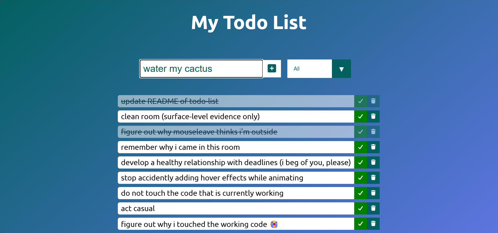

# Todo List

A simple Todo List webpage built with HTML, CSS, and JavaScript.

## Features

- Add new tasks
- Mark tasks as completed
- Delete tasks
- Store tasks using browser storage
- Interactive hover effects and transitions

## Technologies Used

- HTML5
- CSS3
- JavaScript
- Google Fonts
- Font Awesome

## Screenshot

## What I Learned

- DOM manipulation
- JavaScript events
- Local Storage and Session Storage
- JSON
- CSS transitions and hover effects
- Responsive CSS units

## Credits

This project was built while following DevelopedByEd's Todo List tutorial.

I also made my own changes and experimented with the design and functionality along the way.
